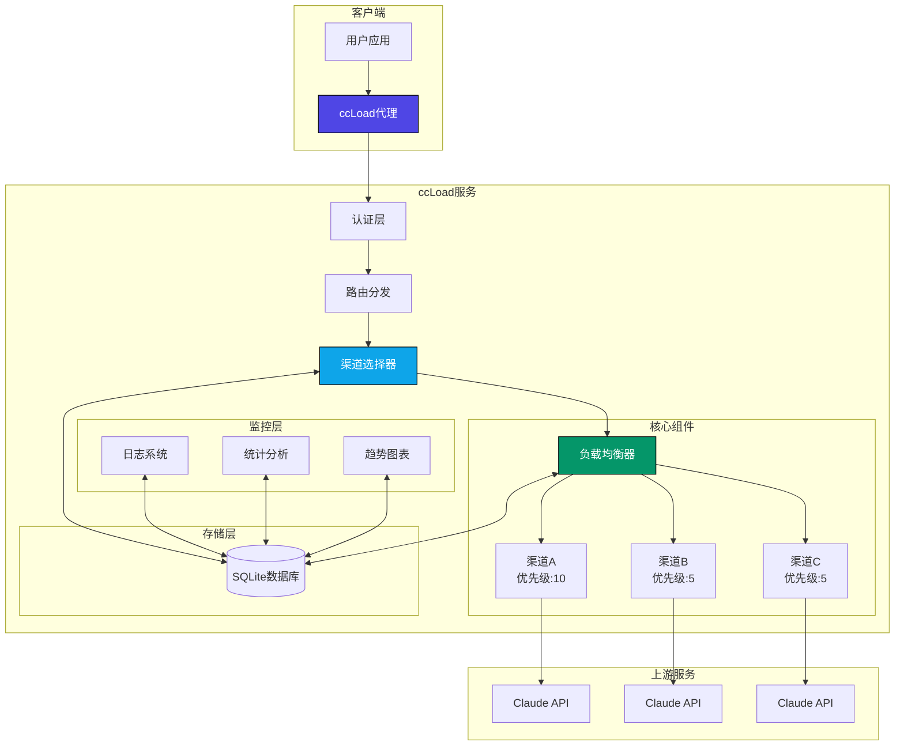

# ccLoad - Claude Code API 代理服务

[](https://golang.org)
[](https://github.com/gin-gonic/gin)
[](LICENSE)

一个高性能的 Claude Code API 透明代理服务，使用 Go 1.24.0 和 Gin 框架构建。支持多渠道负载均衡、故障切换和实时监控。

## 🎯 痛点解决

在使用 Claude API 服务时，用户通常会面临以下痛点：

- **多渠道管理复杂**：需要同时管理多个 API 渠道，有的渠道时效短，有的渠道每天有限量
- **手动切换不便**：每次手动切换渠道费时费力，影响工作效率
- **故障处理困难**：当某个渠道出现故障时，需要手动切换到其他可用渠道

ccLoad 通过以下特性解决这些痛点：

- **智能路由**：根据渠道优先级优先请求高优先级渠道，相同优先级则轮询调用
- **自动故障切换**：当渠道出现故障时，自动切换到其他可用渠道
- **指数级冷却机制**：故障渠道使用指数级别冷却时间，避免持续请求故障服务
- **零手动干预**：客户端无需手动切换上游渠道，系统自动处理

## ✨ 主要特性

- 🚀 **高性能架构** - 基于 Gin 框架，支持 1000+ 并发连接，响应延迟降低 50-80%
- ⚡ **性能优化** - Sonic JSON 库 + Ristretto 缓存 + 连接池优化
- 🔀 **智能路由** - 基于优先级和轮询的渠道选择算法
- 🛡️ **故障切换** - 自动失败检测和指数退避冷却机制
- 📊 **实时监控** - 内置趋势分析、日志记录和统计面板
- 🎯 **透明代理** - 仅替换 API Key，保持请求完整性
- 📦 **单文件部署** - 无外部依赖，包含嵌入式 SQLite
- 🔒 **安全认证** - 基于 Session 的管理界面访问控制
- 🏷️ **构建标签** - 支持 GOTAGS，默认启用高性能 JSON 库

## 🏗️ 架构概览



## 🚀 快速开始

### 安装

```bash
# 克隆项目
git clone <repository-url>
cd ccLoad

# 构建项目（默认使用高性能 JSON 库）
go build -tags go_json -o ccload .

# 或使用 Makefile
make build

# 直接运行开发模式
go run -tags go_json .
# 或
make dev
```

### 基本配置

```bash
# 设置环境变量
export CCLOAD_PASS=your_admin_password
export CCLOAD_AUTH=token1,token2,token3  # 可选，API 访问令牌
export PORT=8080
export SQLITE_PATH=./data/ccload.db

# 或使用 .env 文件
echo "CCLOAD_PASS=your_admin_password" > .env
echo "CCLOAD_AUTH=your_api_token" >> .env
echo "PORT=8080" >> .env
echo "SQLITE_PATH=./data/ccload.db" >> .env

# 启动服务
./ccload
```

服务启动后访问：
- 管理界面：`http://localhost:8080/web/`
- API 代理：`POST http://localhost:8080/v1/messages`

## 📖 使用说明

### API 代理

发送请求到 Claude API：

```bash
# 无需认证（未设置 CCLOAD_AUTH）
curl -X POST http://localhost:8080/v1/messages \
  -H "Content-Type: application/json" \
  -H "x-api-key: your-claude-api-key" \
  -H "anthropic-version: 2023-06-01" \
  -d '{
    "model": "claude-3-sonnet-20240229",
    "max_tokens": 1024,
    "messages": [
      {
        "role": "user",
        "content": "Hello, Claude!"
      }
    ]
  }'

# 需要认证（设置了 CCLOAD_AUTH）
curl -X POST http://localhost:8080/v1/messages \
  -H "Content-Type: application/json" \
  -H "Authorization: Bearer your-api-token" \
  -H "x-api-key: your-claude-api-key" \
  -H "anthropic-version: 2023-06-01" \
  -d '{
    "model": "claude-3-sonnet-20240229",
    "max_tokens": 1024,
    "messages": [
      {
        "role": "user",
        "content": "Hello, Claude!"
      }
    ]
  }'
```

### 渠道管理

通过 Web 界面 `/web/channels.html` 或 API 管理渠道：

```bash
# 添加渠道
curl -X POST http://localhost:8080/admin/channels \
  -H "Content-Type: application/json" \
  -d '{
    "name": "Claude-API",
    "api_key": "sk-ant-api03-xxx",
    "url": "https://api.anthropic.com",
    "priority": 10,
    "models": ["claude-3-sonnet-20240229", "claude-3-opus-20240229"],
    "enabled": true
  }'
```

## 📊 监控指标

访问管理界面查看：
- 24 小时请求趋势图
- 实时错误日志
- 渠道调用统计
- 性能指标监控

## 🔧 配置说明

### 环境变量

| 变量名 | 默认值 | 说明 |
|--------|--------|------|
| `CCLOAD_PASS` | "admin" | 管理界面密码 |
| `CCLOAD_AUTH` | 无 | API 访问令牌（多个用逗号分隔） |
| `PORT` | "8080" | 服务端口 |
| `SQLITE_PATH` | "data/ccload.db" | 数据库文件路径 |
| `GOTAGS` | "go_json" | 构建标签（go_json/std） |

### 数据库结构

- `channels` - 渠道配置
- `logs` - 请求日志
- `cooldowns` - 冷却状态（channel_id, until, duration_ms）
- `rr` - 轮询指针（model, priority, next_index）

## 🛡️ 安全考虑

- 生产环境必须设置强密码 `CCLOAD_PASS`
- 建议设置 `CCLOAD_AUTH` 以保护 API 端点访问
- API Key 仅在内存使用，不记录日志
- 支持 HttpOnly 和 SameSite Cookie
- 建议使用 HTTPS 反向代理

## 🤝 贡献

欢迎提交 Issue 和 Pull Request！

## 📄 许可证

MIT License