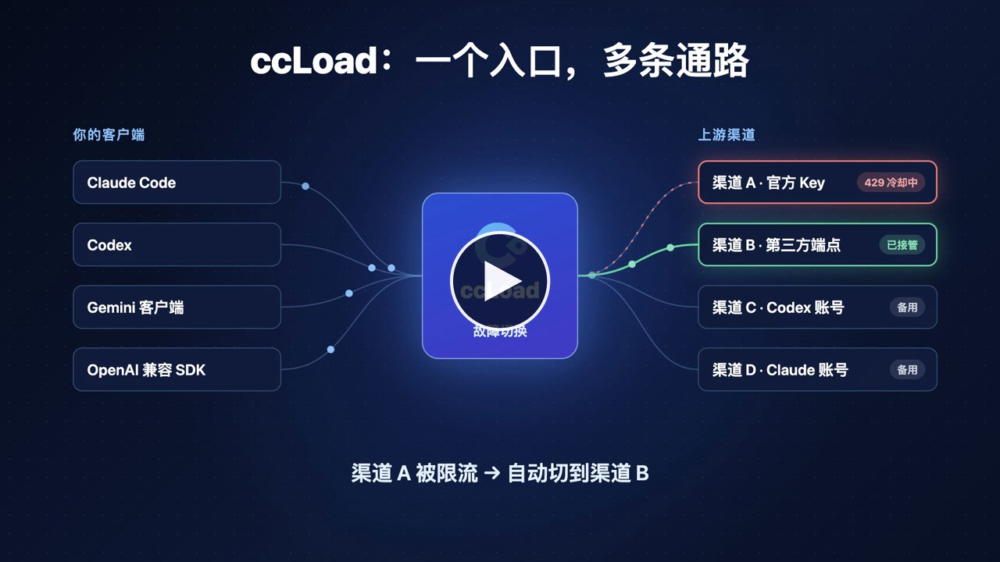
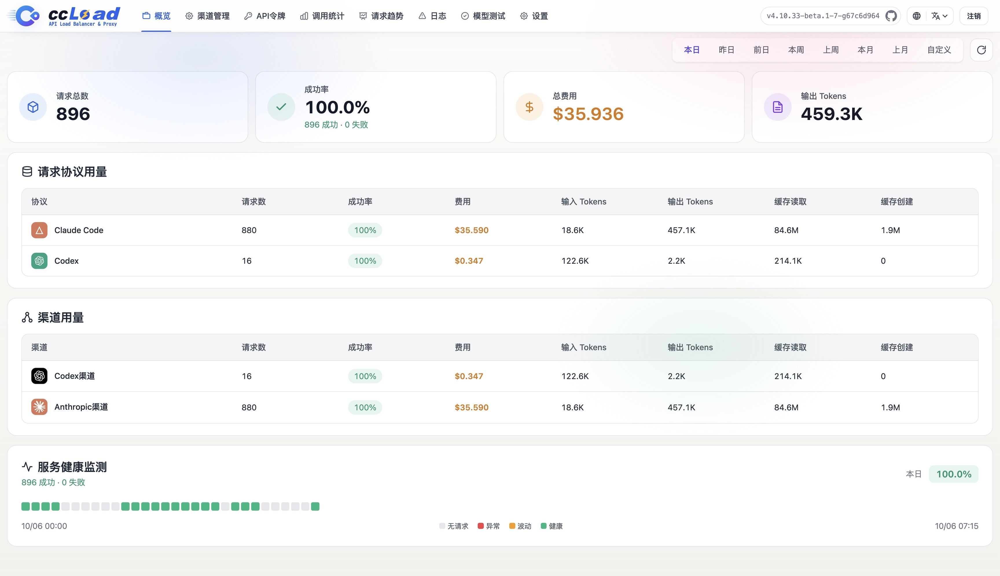
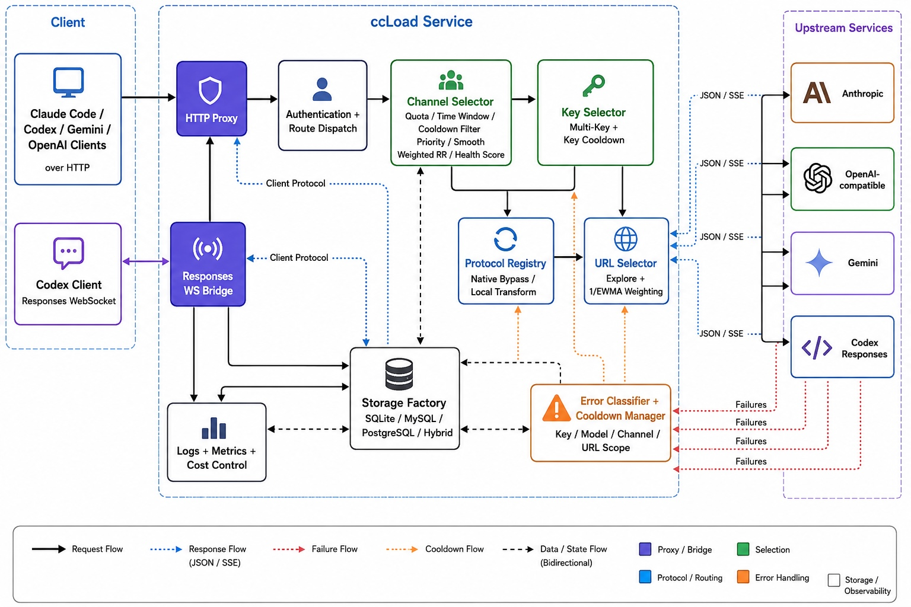

# ccLoad

**自托管的 AI API 网关，面向 Claude Code、Codex、Gemini 和 OpenAI 兼容客户端。**

**[English](README.md) | 简体中文** · [官网](https://ccload.xyz)

[](https://github.com/caidaoli/ccLoad/releases/latest)
[](https://github.com/caidaoli/ccLoad/actions/workflows/test.yml)
[](go.mod)
[](LICENSE)

ccLoad 在多个 AI API 上游前面提供一个稳定入口。客户端只需要一个地址和一个 ccLoad 令牌，渠道选择、故障切换、冷却、协议转换、请求可观测性和费用限制都由网关处理。

[](https://ccload.xyz/assets/video/ccload-promo.zh-CN.mp4?v=20261002)

▶ [观看 47 秒介绍视频](https://ccload.xyz/assets/video/ccload-promo.zh-CN.mp4?v=20261002) · [English](https://ccload.xyz/assets/video/ccload-promo.en.mp4?v=20261002)

## 解决什么问题

手工维护多个 AI API 渠道，迟早会遇到这些问题：

- **渠道切换靠手工**：不同 Key、有效期、额度和上游 URL 混在一起，迟早失控。
- **限流和故障打断工作流**：`429`、`502`、`504`、Key 过期、供应商过载，都不应该让客户端直接停摆。
- **请求状态不可见**：长时间流式请求没有实时状态，只能猜卡在客户端、网关还是上游。
- **HTTP 200 里藏错误**：部分上游返回成功状态码，但响应体实际是错误。
- **成本不可控**：共享网关需要渠道级和令牌级限额，不能等账单出来再补救。

## 功能

### 路由与容错

- **优先级路由**：高优先级渠道优先使用，同级渠道按平滑加权轮询分流，并按健康度动态排序。
- **按作用域故障切换**：错误分为 Key 级、模型级、渠道级和客户端级，只跳过出问题的那一层。冷却统一使用指数退避，上游给出明确恢复时间时以它为准。
- **模型感知冷却**：单个模型故障只冷却该模型，同渠道其他模型继续可用；只有所有配置模型或所有启用 Key 都在冷却时才冷却整个渠道。
- **软错误检测**：HTTP 200 但响应体是错误、SSE `error` 事件中的明确限流、额度用尽错误，都走和普通上游故障相同的切换路径。
- **单渠道多 URL**：按延迟加权选择，每个 URL 独立冷却。
- **渠道限制**：每日成本、RPM、并发、可用时段和 Key 模型白名单会让渠道退出选路，但不触发冷却。
- **渠道级上游代理**：支持 http/https/socks5/socks5h，连接池相互隔离。
- **定时检测**：后台探测，自动发现故障渠道。

### 协议与客户端

- **每个渠道接受四种客户端协议**：Anthropic、OpenAI、Codex（Responses）和 Gemini。每个上游 URL 可声明支持的线协议，留空则由 ccLoad 探测并缓存；客户端协议与上游不一致时自动转换。
- **Responses WebSocket**：Codex 客户端保持下游 WebSocket，各候选渠道使用原生 Codex WebSocket 或 HTTP/SSE。
- **账号类渠道**：Codex（ChatGPT）OAuth 与个人访问令牌、Anthropic（Claude）、Antigravity、xAI OAuth，以及 Z.ai Coding Plan、Cursor、Zed；支持的提供商自动刷新令牌，可批量导入、刷新额度，凭证被上游永久拒绝时自动禁用。
- **模型思考后缀**：`model(high)` 或 `model(16384)` 映射为上游协议的思考参数，选路仍按基础模型名。
- **多模态回退**：含图片或文件的请求在选路前从非视觉模型改用配置的回退模型。
- **自定义请求规则**：渠道级请求头和 JSON 请求体改写，认证头受保护。
- **本地 Token 计数**：`/v1/messages/count_tokens` 在本地计算，不调用上游。

### 成本与权限

- **API 令牌**：每个令牌可设费用上限、模型限制、渠道白名单/黑名单和并发上限。上游凭证留在网关。
- **成本核算**：OpenAI `service_tier` 倍率、长上下文分层定价、缓存 Token 折扣和图像生成工具计费。
- **OAuth 额度成本**：按凭证累计周/月标准成本，对齐上游额度窗口。
- **令牌只读登录**：API 令牌可登录管理后台，只能查看自己的用量。

### 可观测

- **数据面板**：活跃请求、趋势、日志、Token 用量、首字节时间，以及按渠道、模型和令牌统计的费用，另有进程指标（CPU、RSS、GC）。
- **请求控制**：在日志页中断进行中的请求，按上游断链处理并触发故障切换。
- **调试日志**：捕获上游请求和响应原文，敏感头脱敏。
- **模型测试工作台**：按渠道、按模型或对话方式测试，支持图片上传、思考等级、内置搜索和图片生成。




### 部署

- **单个二进制文件**，内嵌 SQLite；可选 MySQL 或 PostgreSQL，以及让 SQLite 留在热路径上的混合模式。
- **多架构 Docker 镜像**（`linux/amd64`、`linux/arm64`）发布在 GHCR，也可部署到 Hugging Face Spaces。
- **更新渠道**：稳定版或测试版，替换二进制前校验 SHA-256；容器通过拉取新 Tag 更新。
- **CSV 导入导出**渠道配置。

## 工作原理



请求先用 ccLoad 令牌认证，再按模型、优先级和限制匹配候选渠道，转发到某个上游 URL 和 Key。上游在任何输出到达客户端之前失败时，ccLoad 冷却出问题的那一层并尝试下一个候选。只有客户端协议和所选上游协议不一致时才做协议转换。详见[架构](docs/guide/architecture.zh-CN.md)。

## 快速开始

```bash
docker run -d --name ccload \
  -p 8080:8080 \
  -e CCLOAD_PASS=your_secure_password \
  -v ccload_data:/app/data \
  ghcr.io/caidaoli/ccload:latest
```

或使用 Docker Compose：

```bash
curl -o docker-compose.yml https://raw.githubusercontent.com/caidaoli/ccLoad/master/docker-compose.yml
curl -o .env https://raw.githubusercontent.com/caidaoli/ccLoad/master/.env.docker.example
# 编辑 .env 设置 CCLOAD_PASS（必填，未设置服务会拒绝启动）
docker compose up -d
```

然后：

1. 打开 `http://localhost:8080/web/`，用 `CCLOAD_PASS` 登录。
2. 在**渠道管理**页添加渠道：上游 URL、API Key 或账号凭证、模型。
3. 在 **API令牌** 页（`/web/tokens.html`）创建 API 令牌。没有令牌时，所有 `/v1/*` 和 `/v1beta/*` 请求都返回 `401`。
4. 把客户端指向网关：

```bash
curl -X POST http://localhost:8080/v1/messages \
  -H "Content-Type: application/json" \
  -H "Authorization: Bearer your-api-token" \
  -H "anthropic-version: 2023-06-01" \
  -d '{
    "model": "claude-sonnet-4-6",
    "max_tokens": 1024,
    "messages": [{"role": "user", "content": "Hello, Claude!"}]
  }'
```

```bash
# Claude Code
export ANTHROPIC_BASE_URL=http://localhost:8080
export ANTHROPIC_AUTH_TOKEN=your-api-token
```

```toml
# Codex CLI：先用 ccLoad 令牌执行 `codex login --with-api-key`，再修改 ~/.codex/config.toml
openai_base_url = "http://localhost:8080/v1"
```

二进制下载、源码编译、Hugging Face Spaces 和外部数据库见[部署](docs/guide/deployment.zh-CN.md)。

## 文档

| 主题 | 内容 |
|------|------|
| [部署](docs/guide/deployment.zh-CN.md) | Docker、二进制、源码编译、Hugging Face Spaces、数据库、镜像标签、更新、故障排除 |
| [使用说明](docs/guide/usage.zh-CN.md) | API 端点、Codex CLI 与 Responses WebSocket、思考后缀、渠道管理、请求规则、CSV 导入导出、管理后台 |
| [配置说明](docs/guide/configuration.zh-CN.md) | 环境变量、存储模式、系统设置、渠道排序、API 令牌、认证 |
| [架构](docs/guide/architecture.zh-CN.md) | 协议路由、依赖、模块划分、数据库结构 |

官网以引导页的形式覆盖相同主题：[安装](https://ccload.xyz/install.html) · [配置](https://ccload.xyz/config.html) · [使用](https://ccload.xyz/usage.html) · [反馈](https://ccload.xyz/feedback.html)。

## 安全

- 设置强密码 `CCLOAD_PASS`；未设置时服务不会启动。
- 给客户端发 ccLoad API 令牌，不要发上游 Key。令牌在 `/web/tokens.html` 管理。
- 上游 API Key 和账号凭证保存在数据库中，CSV 导出也包含它们。保护好数据库，导出文件用完即删。
- 浏览器只保存随机的 Web 会话令牌，24 小时过期。
- 部署在 HTTPS 反向代理之后，并设置 `TRUSTED_PROXIES`，避免伪造转发的客户端地址。

## 贡献

欢迎提交 Issue 和 PR：https://github.com/caidaoli/ccLoad/issues

Go 命令必须带 `sonic` 构建标签。提交改动前，按影响范围运行对应验证：

```bash
go test -tags sonic ./internal/...
make verify-web     # 前端 node:test 验证
make race-fast      # 并发敏感包；全量使用 make race
golangci-lint run ./...
bash .agents/skills/sync-cliproxy-core/scripts/verify.sh --tests  # 协议转换有改动时
```

## 许可证

MIT License。`internal/protocol/cliproxy` 下的同步转换核心保留其上游 [MIT 许可证](internal/protocol/cliproxy/LICENSE)与[来源记录](internal/protocol/cliproxy/UPSTREAM.md)。
