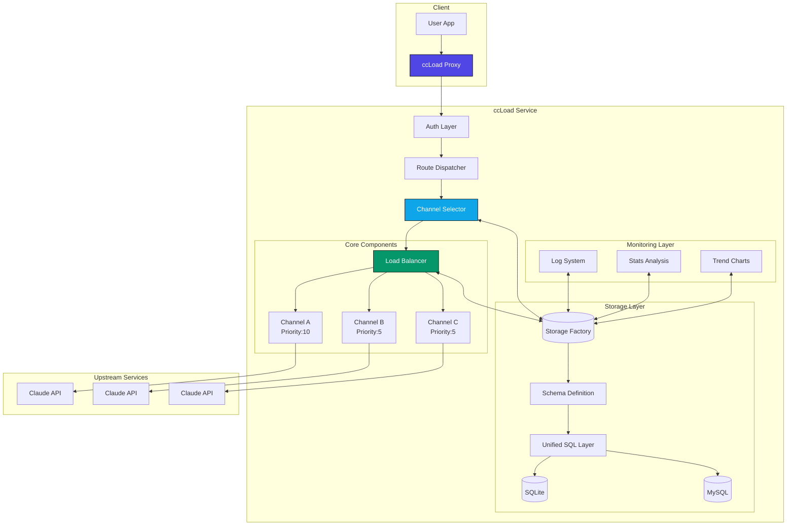
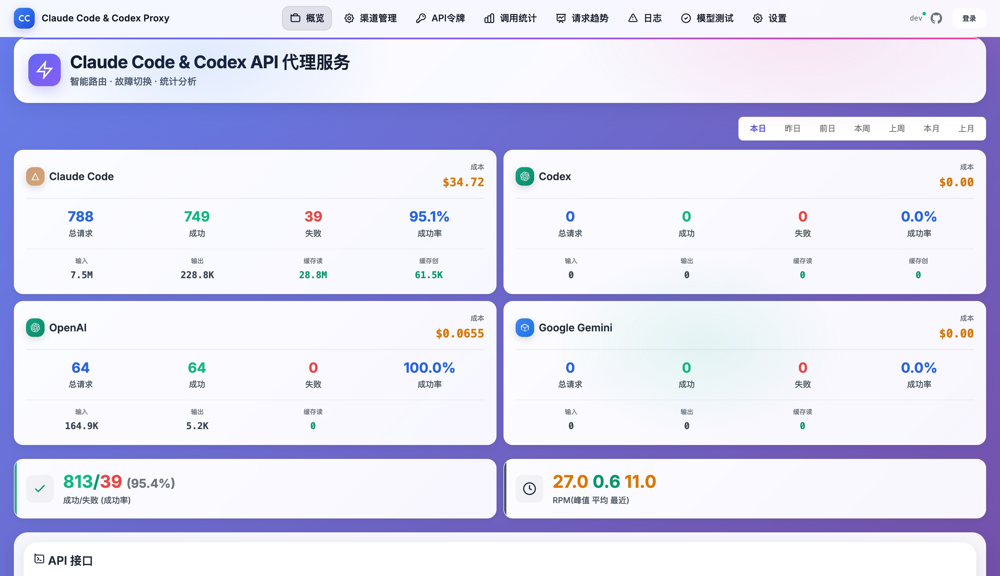
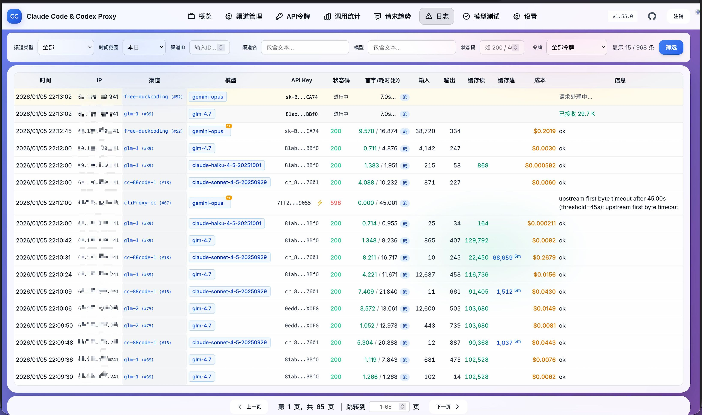

# ccLoad - Claude Code & Codex & Gemini & OpenAI Compatible API Proxy Service

**English | [简体中文](README.md)**

[](https://golang.org)
[](https://github.com/gin-gonic/gin)
[](https://hub.docker.com)
[](https://huggingface.co/spaces)
[](https://github.com/features/actions)
[](LICENSE)

> 🚀 High-Performance AI API Proxy | Smart Multi-Channel Routing | Instant Failover | Real-time Monitoring | Production-Ready

Managing multiple Claude API channels getting chaotic? Manual failover when rate limits hit? ccLoad has you covered! A high-performance Go-based proxy service supporting Claude Code, Codex, Gemini, and OpenAI. **Smart routing + automatic failover + real-time monitoring** - rock-solid API reliability 🚀

## 🎯 Pain Points Solved

When using Claude API services, users typically face these challenges:

- **Complex multi-channel management**: Managing multiple API channels simultaneously, some with short validity, others with daily limits
- **Inconvenient manual switching**: Time-consuming manual channel switching affects work efficiency
- **Difficult failure handling**: Manual switching to other available channels when one fails
- **Opaque request status**: Traditional approaches leave you blindly waiting without knowing request progress
- **Hidden upstream errors**: Some third-party channels return HTTP 200 status but with error content in the response body, making it difficult for clients to detect and handle

ccLoad solves these pain points through:

- **Smart routing**: Prioritizes high-priority channels, smooth weighted round-robin for same priority with more even distribution
- **Automatic failover**: Automatically switches to available channels when failures occur
- **Exponential cooldown**: Failed channels use exponential backoff to avoid hammering failed services
- **Zero manual intervention**: Clients don't need to manually switch upstream channels
- **Real-time request monitoring**: Log management interface shows ongoing requests - no more blind waiting, clear visibility into each request's status
- **Soft error detection**: Automatically detects HTTP 200 responses that are actually errors ("masqueraded responses"), triggering channel cooldown and failover. Common scenarios include:
  - JSON responses containing `{"error": {...}}` structure
  - Responses with `type` field set to `"error"`
  - Plain text messages like `"当前模型负载过高"` / `"Current model load too high"` (load warnings)

## ✨ Key Features

- 🚀 **High-Performance Architecture** - Gin framework, 1000+ concurrent connections, high-performance caching
- 🧮 **Local Token Counting** - API-compliant local token estimation, <5ms response, 93%+ accuracy, supports large-scale tool scenarios
- 🎯 **Smart Error Classification** - Distinguishes Key/Channel/Client errors, soft error detection (200 masquerading as error), 1308 quota handling (596/597 status codes)
- 🔀 **Smart Routing** - Priority + smooth weighted round-robin channel selection, **pre-filters cooled channels**, multi-key load balancing, **health-based dynamic sorting** (confidence factor prevents small sample over-penalization)
- 🛡️ **Failover** - Automatic failure detection with exponential backoff cooldown (1s → 2s → 4s → ... → 30min)
- 🔒 **Race-Safe** - Key selector race condition protection, startup config validation, automatic resource cleanup
- 📊 **Real-time Monitoring** - Built-in trend analysis, logging, and stats dashboard, **Token usage stats** with time range selection and per-token classification
- 🎯 **Transparent Proxy** - Supports Claude, Gemini, and OpenAI compatible APIs with smart auth detection
- 📦 **Single Binary Deployment** - No external dependencies, embedded SQLite included
- 🔒 **Secure Authentication** - Token-based admin interface and API access control
- 🏷️ **Build Tags** - GOTAGS support, high-performance JSON library enabled by default
- 🐳 **Docker Support** - Multi-arch images (amd64/arm64), automated CI/CD
- ☁️ **Cloud Native** - Container deployment support, GitHub Actions auto-build
- 🤗 **Hugging Face** - One-click deployment to Hugging Face Spaces, free hosting
- 💰 **Cost Limits** - Per-channel daily cost limits, per-token cost limits
- 🔐 **Token Restrictions** - API token cost limits + model restrictions for fine-grained access control
- ⏱️ **TTFB Monitoring** - Streaming request first byte time tracking for upstream latency diagnosis

## 🏗️ Architecture Overview



## 🚀 Quick Start

Choose the deployment method that suits you best:

| Method | Difficulty | Cost | Use Case | HTTPS | Persistence |
|--------|------------|------|----------|-------|-------------|
| 🐳 **Docker** | ⭐⭐ | VPS required | Production, high performance | Config required | ✅ |
| 🤗 **Hugging Face** | ⭐ | **Free** | Personal use, quick trial | ✅ Auto | ✅ |
| 🔧 **Source Build** | ⭐⭐⭐ | Server required | Development, customization | Config required | ✅ |
| 📦 **Binary** | ⭐⭐ | Server required | Lightweight, simple setup | Config required | ✅ |

### Method 1: Docker Deployment (Recommended)

**Using pre-built images (Recommended)**:
```bash
# Option 1: Using docker-compose (Simplest)
curl -o docker-compose.yml https://raw.githubusercontent.com/caidaoli/ccLoad/master/docker-compose.yml
curl -o .env https://raw.githubusercontent.com/caidaoli/ccLoad/master/.env.example
# Edit .env file to set password
docker-compose up -d

# Option 2: Run image directly
docker pull ghcr.io/caidaoli/ccload:latest
docker run -d --name ccload \
  -p 8080:8080 \
  -e CCLOAD_PASS=your_secure_password \
  -v ccload_data:/app/data \
  ghcr.io/caidaoli/ccload:latest
```

**Building from source**:
```bash
# Clone project
git clone https://github.com/caidaoli/ccLoad.git
cd ccLoad

# Build and run with docker-compose
docker-compose -f docker-compose.build.yml up -d

# Or build manually
docker build -t ccload:local .
docker run -d --name ccload \
  -p 8080:8080 \
  -e CCLOAD_PASS=your_secure_password \
  -v ccload_data:/app/data \
  ccload:local
```

### Method 2: Source Build

```bash
# Clone project
git clone https://github.com/caidaoli/ccLoad.git
cd ccLoad

# Build project (uses high-performance JSON library by default)
go build -tags go_json -o ccload .

# Or use Makefile
make build

# Run in development mode
go run -tags go_json .
# Or
make dev
```

### Method 3: Binary Download

```bash
# Download binary for your platform from GitHub Releases
wget https://github.com/caidaoli/ccLoad/releases/latest/download/ccload-linux-amd64
chmod +x ccload-linux-amd64
./ccload-linux-amd64
```

### Method 4: Hugging Face Spaces Deployment

Hugging Face Spaces provides free container hosting with Docker support, ideal for personal and small team use.

#### Deployment Steps

1. **Login to Hugging Face**

   Visit [huggingface.co](https://huggingface.co) and log into your account

2. **Create New Space**

   - Click "New" → "Space" in the top right
   - **Space name**: `ccload` (or custom name)
   - **License**: `MIT`
   - **Select the SDK**: `Docker`
   - **Visibility**: `Public` or `Private` (private requires paid subscription)
   - Click "Create Space"

3. **Create Dockerfile**

   Create a `Dockerfile` in the Space repository:

   ```dockerfile
   FROM ghcr.io/caidaoli/ccload:latest
   ENV TZ=Asia/Shanghai
   ENV PORT=7860
   ENV SQLITE_PATH=/tmp/ccload.db
   EXPOSE 7860
   ```

   Create via:

   **Method A - Web Interface** (Recommended):
   - Click "Files" tab on Space page
   - Click "Add file" → "Create a new file"
   - Enter `Dockerfile` as filename
   - Paste the content above
   - Click "Commit new file to main"

   **Method B - Git Command Line**:
   ```bash
   # Clone your Space repository
   git clone https://huggingface.co/spaces/YOUR_USERNAME/ccload
   cd ccload

   # Create Dockerfile
   cat > Dockerfile << 'EOF'
   FROM ghcr.io/caidaoli/ccload:latest
   ENV TZ=Asia/Shanghai
   ENV PORT=7860
   ENV SQLITE_PATH=/tmp/ccload.db
   EXPOSE 7860
   EOF

   # Commit and push
   git add Dockerfile
   git commit -m "Add Dockerfile for ccLoad deployment"
   git push
   ```

4. **Configure Environment Variables (Secrets)**

   In Space settings (Settings → Variables and secrets → New secret):

   | Variable | Value | Required | Description |
   |----------|-------|----------|-------------|
   | `CCLOAD_PASS` | `your_admin_password` | ✅ **Required** | Admin interface password |

   **Note**: API access tokens are now configured via Web admin interface `/web/tokens.html`, not environment variables.

5. **Wait for Build and Startup**

   After pushing Dockerfile, Hugging Face will automatically:
   - Pull pre-built image (~30 seconds)
   - Start application container (~10 seconds)
   - Total time ~1-2 minutes (3-5x faster than source build)

6. **Access Application**

   After build completes, access via:
   - **App URL**: `https://YOUR_USERNAME-ccload.hf.space`
   - **Admin Interface**: `https://YOUR_USERNAME-ccload.hf.space/web/`
   - **API Endpoint**: `https://YOUR_USERNAME-ccload.hf.space/v1/messages`

   **First Access Note**:
   - If Space is sleeping, first access takes 20-30 seconds to wake
   - Subsequent accesses respond immediately

#### Hugging Face Deployment Characteristics

**Advantages**:
- ✅ **Completely Free**: Public Spaces are permanently free with CPU and storage
- ✅ **Fast Deployment**: Pre-built image, 1-2 minutes (3-5x faster than source build)
- ✅ **Auto HTTPS**: No SSL certificate configuration needed
- ✅ **Auto Restart**: Automatic restart after crashes
- ✅ **Version Control**: Git-based, easy rollback and collaboration
- ✅ **Simple Maintenance**: Only 5-line Dockerfile, no source code management

**Limitations**:
- ⚠️ **Resource Limits**: Free tier provides 2 CPU + 16GB RAM
- ⚠️ **Sleep Policy**: 48 hours without access triggers sleep, first access takes ~20-30s to wake
- ⚠️ **Fixed Port**: Must use port 7860
- ⚠️ **Public Access**: Spaces are public by default, must configure API tokens via Web admin to access /v1/* APIs (otherwise 401)

#### Data Persistence

**Important**: Hugging Face Spaces Storage Policy

Due to Hugging Face Spaces limitations (`/tmp` directory clears on restart), **we strongly recommend using an external MySQL database** for complete data persistence:

**Option 1: Hybrid Storage Mode (Recommended, Best Performance)**
- ✅ **Ultra-fast queries**: All reads/writes go through local SQLite, latency <1ms (free MySQL has 800ms+ latency)
- ✅ **Restart-safe**: Async sync to MySQL, auto-restore on startup
- ✅ **Stats caching**: Smart TTL cache reduces repetitive aggregate queries
- Configuration: Add `CCLOAD_MYSQL` + `CCLOAD_ENABLE_SQLITE_REPLICA=1` in Secrets

**Dockerfile Example (Hybrid Mode)**:
```dockerfile
FROM ghcr.io/caidaoli/ccload:latest
ENV TZ=Asia/Shanghai
ENV PORT=7860
# Configure in Secrets: CCLOAD_MYSQL + CCLOAD_ENABLE_SQLITE_REPLICA=1
EXPOSE 7860
```

**Option 2: Pure MySQL Mode**
- ✅ **Complete Persistence**: Channel configs, logs, and stats all preserved
- ✅ **Restart-Safe**: Data stored externally, unaffected by Space restarts
- ⚠️ **Slower Queries**: Free MySQL has higher latency, stats pages respond slowly
- Configuration: Add `CCLOAD_MYSQL` environment variable in Secrets

**Recommended Free MySQL Services**:
- [TiDB Cloud Serverless](https://tidbcloud.com/) - Free 5GB storage, MySQL compatible, no connection limits, recommended first choice
- [Aiven for MySQL](https://aiven.io/) - Free 1GB storage, multi-region support

**MySQL Configuration Example (TiDB Cloud)**:
1. Register for [TiDB Cloud](https://tidbcloud.com/) account
2. Create Serverless Cluster (free)
3. Get connection info, format: `user:password@tcp(host:4000)/database?tls=true`
4. Add `CCLOAD_MYSQL` variable in Hugging Face Space Secrets
5. **(Optional) Enable Hybrid Mode**: Add `CCLOAD_ENABLE_SQLITE_REPLICA=1` for best performance
6. Restart Space, all data will auto-persist to MySQL

**Dockerfile Example (Pure MySQL)**:
```dockerfile
FROM ghcr.io/caidaoli/ccload:latest
ENV TZ=Asia/Shanghai
ENV PORT=7860
# No SQLITE_PATH needed, uses CCLOAD_MYSQL environment variable
EXPOSE 7860
```

**Option 3: Local Storage Only (Not Recommended)**
- ⚠️ **Data Loss**: `/tmp` clears on Space restart, channel config lost
- ⚠️ **Manual Recovery**: Must re-import via Web interface or CSV
- Use case: Temporary testing only

#### Update Deployment

With pre-built images, updates are simple:

**Auto Update**:
- When new version image (`ghcr.io/caidaoli/ccload:latest`) is released
- Click "Factory rebuild" in Space settings to pull latest image
- Or wait for Hugging Face auto-restart (typically after 48 hours)

**Manual Trigger Update**:
```bash
# Add empty commit to trigger rebuild
git commit --allow-empty -m "Trigger rebuild to pull latest image"
git push
```

**Version Pinning** (Optional):
To lock specific version, modify Dockerfile:
```dockerfile
FROM ghcr.io/caidaoli/ccload:v0.2.0  # Specify version
ENV TZ=Asia/Shanghai
ENV PORT=7860
ENV SQLITE_PATH=/tmp/ccload.db
EXPOSE 7860
```

### Basic Configuration

**SQLite Mode (Default)**:
```bash
# Set environment variables
export CCLOAD_PASS=your_admin_password
export PORT=8080
export SQLITE_PATH=./data/ccload.db

# Or use .env file
echo "CCLOAD_PASS=your_admin_password" > .env
echo "PORT=8080" >> .env
echo "SQLITE_PATH=./data/ccload.db" >> .env

# Start service
./ccload
```

**MySQL Mode**:
```bash
# 1. Create MySQL database
mysql -u root -p -e "CREATE DATABASE ccload CHARACTER SET utf8mb4 COLLATE utf8mb4_unicode_ci;"

# 2. Set environment variables
export CCLOAD_PASS=your_admin_password
export CCLOAD_MYSQL="user:password@tcp(localhost:3306)/ccload?charset=utf8mb4"
export PORT=8080

# Or use .env file
echo "CCLOAD_PASS=your_admin_password" > .env
echo "CCLOAD_MYSQL=user:password@tcp(localhost:3306)/ccload?charset=utf8mb4" >> .env
echo "PORT=8080" >> .env

# 3. Start service (auto-creates tables)
./ccload
```

**Docker + MySQL**:
```bash
# Option 1: docker-compose (Recommended)
cat > docker-compose.mysql.yml << 'EOF'
version: '3.8'
services:
  mysql:
    image: mysql:8.0
    environment:
      MYSQL_ROOT_PASSWORD: rootpass
      MYSQL_DATABASE: ccload
      MYSQL_USER: ccload
      MYSQL_PASSWORD: ccloadpass
    volumes:
      - mysql_data:/var/lib/mysql
    ports:
      - "3306:3306"
    healthcheck:
      test: ["CMD", "mysqladmin", "ping", "-h", "localhost"]
      interval: 10s
      timeout: 5s
      retries: 5

  ccload:
    image: ghcr.io/caidaoli/ccload:latest
    environment:
      CCLOAD_PASS: your_admin_password
      CCLOAD_MYSQL: "ccload:ccloadpass@tcp(mysql:3306)/ccload?charset=utf8mb4"
      PORT: 8080
    ports:
      - "8080:8080"
    depends_on:
      mysql:
        condition: service_healthy

volumes:
  mysql_data:
EOF

docker-compose -f docker-compose.mysql.yml up -d

# Option 2: Direct run (requires existing MySQL service)
docker run -d --name ccload \
  -p 8080:8080 \
  -e CCLOAD_PASS=your_admin_password \
  -e CCLOAD_MYSQL="user:pass@tcp(mysql_host:3306)/ccload?charset=utf8mb4" \
  ghcr.io/caidaoli/ccload:latest
```

After service starts, access:
- Admin Interface: `http://localhost:8080/web/`
- API Proxy: `POST http://localhost:8080/v1/messages`
- **API Token Management**: `http://localhost:8080/web/tokens.html` - Configure API access tokens via Web interface

## 📖 Usage Guide

### API Proxy

**Claude API Proxy (Requires Auth)**:

First, configure API access token in Web admin interface `http://localhost:8080/web/tokens.html`, then use that token to access API:

```bash
curl -X POST http://localhost:8080/v1/messages \
  -H "Content-Type: application/json" \
  -H "Authorization: Bearer your-api-token" \
  -H "x-api-key: your-claude-api-key" \
  -H "anthropic-version: 2023-06-01" \
  -d '{
    "model": "claude-3-sonnet-20240229",
    "max_tokens": 1024,
    "messages": [
      {
        "role": "user",
        "content": "Hello, Claude!"
      }
    ]
  }'
```

**OpenAI Compatible API Proxy (Chat Completions)**:

```bash
curl -X POST http://localhost:8080/v1/chat/completions \
  -H "Content-Type: application/json" \
  -H "Authorization: Bearer your-api-token" \
  -d '{
    "model": "gpt-4o",
    "messages": [
      {
        "role": "user",
        "content": "Hello!"
      }
    ]
  }'
```

### Local Token Counting

Quickly estimate request token consumption (no upstream API call needed):

```bash
curl -X POST http://localhost:8080/v1/messages/count_tokens \
  -H "Content-Type: application/json" \
  -d '{
    "model": "claude-3-5-sonnet-20241022",
    "messages": [
      {"role": "user", "content": "Hello, how are you?"}
    ],
    "system": "You are a helpful assistant."
  }'

# Response example
# {
#   "input_tokens": 28
# }
```

**Features**:
- ✅ Compliant with Anthropic official API spec
- ✅ Local computation, <5ms response, no API quota consumption
- ✅ 93%+ accuracy (compared to official API)
- ✅ Supports system prompts, tool definitions, large-scale tool scenarios
- ✅ Requires auth token (configure at `/web/tokens.html`)

### Channel Management

Manage channels via Web interface `/web/channels.html` or API:

```bash
# Add channel
curl -X POST http://localhost:8080/admin/channels \
  -H "Content-Type: application/json" \
  -d '{
    "name": "Claude-API",
    "api_key": "sk-ant-api03-xxx",
    "url": "https://api.anthropic.com",
    "priority": 10,
    "models": ["claude-3-sonnet-20240229", "claude-3-opus-20240229"],
    "enabled": true
  }'
```

### Batch Data Management

Supports CSV format for channel config import/export:

**Export Config**:
```bash
# Web interface: Visit /web/channels.html, click "Export CSV" button
# API call:
curl -H "Authorization: Bearer your_token" \
  http://localhost:8080/admin/channels/export > channels.csv
```

**Import Config**:
```bash
# Web interface: Visit /web/channels.html, click "Import CSV" button
# API call:
curl -X POST -H "Authorization: Bearer your_token" \
  -F "file=@channels.csv" \
  http://localhost:8080/admin/channels/import
```

**CSV Format Example**:
```csv
name,api_key,url,priority,models,enabled
Claude-API-1,sk-ant-xxx,https://api.anthropic.com,10,"[\"claude-3-sonnet-20240229\"]",true
Claude-API-2,sk-ant-yyy,https://api.anthropic.com,5,"[\"claude-3-opus-20240229\"]",true
```

**Features**:
- Auto column name mapping (Chinese/English)
- Smart data validation with error messages
- Incremental import and overwrite update
- UTF-8 encoding, Excel compatible

## 📊 Monitoring Metrics

Check out the awesome admin dashboard 👇



*Real-time Monitoring Dashboard: Claude Code, Codex, OpenAI, and Gemini platform metrics at a glance*

**Core Features**:
- 📈 **24-hour Trend Charts** - Request volumes clearly visualized with peaks and valleys
- 🔴 **Real-time Error Logs** - Instantly detect which channel has issues
- 📊 **Channel Call Statistics** - See which channels are performing well with data-backed insights
- ⚡ **Performance Metrics** - Latency, success rates, and bottleneck detection
- 💰 **Token Usage Stats** - Know exactly where your budget goes:
  - Custom time range selector for flexible analysis
  - Per API token ID classification for multi-tenant billing
  - Supports Gemini/OpenAI cache token visualization

**UI Highlights**:
- 🎨 Modern gradient purple theme for comfortable viewing
- 📱 Responsive design works great on mobile and desktop
- ⚡ Real-time data refresh without manual page reload
- 📊 Multi-dimensional stat cards show key metrics on one screen
  - Cached query optimization
  - Gemini/OpenAI Cache Token (Cache Read) display

## 🔧 Tech Stack

### Core Dependencies

| Component | Version | Purpose | Performance Advantage |
|-----------|---------|---------|----------------------|
| **Go** | 1.25.0+ | Runtime | Native concurrency, built-in min function |
| **Gin** | v1.10.1 | Web Framework | High-performance HTTP routing |
| **SQLite3** | v1.38.2 | Embedded Database | Zero config, single file (default) |
| **MySQL** | v1.8.1 | RDBMS | Optional, for high-concurrency production |
| **Sonic** | v1.14.1 | JSON Library | 2-3x faster than stdlib |
| **godotenv** | v1.5.1 | Env Config | Simplified config management |

### Architecture Features

**Modular Architecture**:
- **Proxy Module Split** (SRP):
  - `proxy_handler.go`: HTTP entry, concurrency control, route selection
  - `proxy_forward.go`: Core forwarding logic, request building, response handling
  - `proxy_error.go`: Error handling, cooldown decisions, retry logic
  - `proxy_util.go`: Constants, type definitions, utility functions
  - `proxy_stream.go`: Streaming responses, first byte detection
  - `proxy_gemini.go`: Gemini API special handling
  - `proxy_sse_parser.go`: SSE parser (defensive handling, Gemini/OpenAI cache token parsing)
- **Admin Module Split** (SRP):
  - `admin_channels.go`: Channel CRUD
  - `admin_stats.go`: Stats analysis API
  - `admin_cooldown.go`: Cooldown management API
  - `admin_csv.go`: CSV import/export
  - `admin_types.go`: Admin API type definitions
  - `admin_auth_tokens.go`: API access token CRUD (with token stats, cost limits, model restrictions)
  - `admin_settings.go`: System settings management
  - `admin_models.go`: Model list management
  - `admin_testing.go`: Channel testing
- **Cooldown Manager** (DRY):
  - `cooldown/manager.go`: Unified cooldown decision engine
  - Eliminates duplicate code, unified cooldown logic
  - Distinguishes network vs HTTP error classification
  - Built-in single-key channel auto-upgrade logic
- **Storage Layer Refactor** (2025-12 optimization, eliminated 467 lines of duplicate code):
  - `storage/schema/`: Unified schema definition (supports SQLite/MySQL differences)
  - `storage/sql/`: Common SQL implementation layer (SQLite/MySQL shared)
  - `storage/factory.go`: Factory pattern auto-selects database
  - Composite index optimization, stats query performance improved

**Multi-level Cache System**:
- Channel config cache (60s TTL)
- Round-robin pointer cache (in-memory)
- Cooldown state inline (channels/api_keys tables store directly)
- Error classification cache (1000 capacity)

**Async Processing Architecture**:
- Log system (1000 buffer + single worker, guarantees FIFO order)
- Token/log cleanup (background goroutine, periodic maintenance)

**Unified Response System**:
- `StandardResponse[T]` generic struct (DRY)
- `ResponseHelper` utility class with 9 shortcut methods
- Auto-extracts app-level error codes, unified JSON format

**Connection Pool Optimization**:
- SQLite: 10 connections for memory mode / 5 for file mode, 5-minute lifetime
- HTTP client: 100 max connections, 30s timeout, keepalive optimization
- TLS: Session cache (1024 capacity), reduces handshake latency

## 🔧 Configuration

### Environment Variables

| Variable | Default | Description |
|----------|---------|-------------|
| `CCLOAD_PASS` | None | Admin password (**Required**, exits if not set) |
| `CCLOAD_MYSQL` | None | MySQL DSN (optional, format: `user:pass@tcp(host:port)/db?charset=utf8mb4`)<br/>**If set uses MySQL, otherwise SQLite** |
| `CCLOAD_ENABLE_SQLITE_REPLICA` | `0` | Hybrid storage mode switch (`1`=enable, see below) |
| `CCLOAD_SQLITE_LOG_DAYS` | `7` | Days of logs to restore from MySQL on startup in hybrid mode (-1=all, 0=no logs) |
| `CCLOAD_ALLOW_INSECURE_TLS` | `0` | Disable upstream TLS cert validation (`1`=enable; ⚠️for troubleshooting/controlled intranet only) |
| `PORT` | `8080` | Service port |
| `GIN_MODE` | `release` | Run mode (`debug`/`release`) |
| `GIN_LOG` | `true` | Gin access log switch (`false`/`0`/`no`/`off` to disable) |
| `SQLITE_PATH` | `data/ccload.db` | SQLite database file path (SQLite mode only) |
| `SQLITE_JOURNAL_MODE` | `WAL` | SQLite Journal mode (WAL/TRUNCATE/DELETE, recommend TRUNCATE for containers) |
| `CCLOAD_MAX_CONCURRENCY` | `1000` | Max concurrent requests (limits simultaneous proxy requests) |
| `CCLOAD_MAX_BODY_BYTES` | `10485760` | Max request body bytes (10MB, prevents memory overflow) |
| `CCLOAD_COOLDOWN_AUTH_SEC` | `300` | Auth error (401/402/403) initial cooldown (seconds) |
| `CCLOAD_COOLDOWN_SERVER_SEC` | `120` | Server error (5xx) initial cooldown (seconds) |
| `CCLOAD_COOLDOWN_TIMEOUT_SEC` | `60` | Timeout error (597/598) initial cooldown (seconds) |
| `CCLOAD_COOLDOWN_RATE_LIMIT_SEC` | `60` | Rate limit error (429) initial cooldown (seconds) |
| `CCLOAD_COOLDOWN_MAX_SEC` | `1800` | Exponential backoff cooldown max (seconds, 30 minutes) |
| `CCLOAD_COOLDOWN_MIN_SEC` | `10` | Exponential backoff cooldown min (seconds) |

#### Hybrid Storage Mode (MySQL Primary + SQLite Cache)

HuggingFace Spaces and similar environments lose local data on restart, but free MySQL has high query latency (800ms+). Hybrid mode offers the best of both worlds:

- **MySQL Primary Storage**: Write operations go to MySQL first, ensuring data persistence
- **SQLite Local Cache**: Read operations go through local SQLite, latency <1ms
- **Startup Recovery**: Restore data from MySQL to SQLite, supports restoring logs by days
- **Log Special Handling**: Write to SQLite first (fast), then async sync to MySQL (backup)

```bash
# Enable hybrid mode
export CCLOAD_MYSQL="user:pass@tcp(host:3306)/db?charset=utf8mb4"
export CCLOAD_ENABLE_SQLITE_REPLICA=1
export CCLOAD_SQLITE_LOG_DAYS=7  # Restore last 7 days of logs (optional)
```

**Three Storage Modes**:
| Mode | Configuration | Use Case |
|------|---------------|----------|
| Pure SQLite | Don't set `CCLOAD_MYSQL` | Local dev, single instance |
| Pure MySQL | Set `CCLOAD_MYSQL` | Standard production |
| Hybrid Mode | Set `CCLOAD_MYSQL` + `CCLOAD_ENABLE_SQLITE_REPLICA=1` | HuggingFace Spaces |

### Web Admin Configuration (Hot Reload Supported)

These settings have been migrated to database, managed via Web interface `/web/settings.html`, changes take effect immediately without restart:

| Setting | Default | Description |
|---------|---------|-------------|
| `log_retention_days` | `7` | Log retention days (-1 for permanent, 1-365 days) |
| `max_key_retries` | `3` | Max key retries within single channel |
| `upstream_first_byte_timeout` | `0` | Upstream first byte timeout (seconds, 0=disabled) |
| `enable_health_score` | `false` | Enable health-based dynamic channel sorting |
| `success_rate_penalty_weight` | `100` | Success rate penalty weight (see below) |
| `health_score_window_minutes` | `30` | Success rate stats time window (minutes) |
| `health_score_update_interval` | `30` | Success rate cache update interval (seconds) |
| `health_min_confident_sample` | `20` | Confidence sample threshold (full penalty at this sample size) |

#### Health Score Sorting

When `enable_health_score` is enabled, the system dynamically adjusts priority based on channel success rate:

```
confidence = min(1.0, sample_count / health_min_confident_sample)
effective_priority = base_priority - (failure_rate × success_rate_penalty_weight × confidence)
```

**Confidence Factor**: Solves over-penalization of new or low-traffic channels due to small sample sizes. Smaller samples = lower confidence = more penalty discount.

**Example** (`success_rate_penalty_weight = 100`, `health_min_confident_sample = 20`):

| Channel | Base Priority | Success Rate | Samples | Confidence | Penalty | Effective Priority |
|---------|---------------|--------------|---------|------------|---------|-------------------|
| A | 100 | 95% | 100 | 1.0 | 5 | **95** |
| B | 90 | 70% | 80 | 1.0 | 30 | **60** |
| C | 80 | 60% | 4 | 0.2 | 8 | **72** |
| D | 70 | 100% | 50 | 1.0 | 0 | **70** |

Base priority order: A > B > C > D
**Effective priority order: A (95) > C (72) > D (70) > B (60)**

#### API Access Token Configuration

**Important**: API access tokens are now configured via Web admin interface, not environment variables.

- Visit `http://localhost:8080/web/tokens.html` for token management
- Supports add, delete, view tokens
- All tokens stored in database with persistence
- Without any tokens configured, all `/v1/*` and `/v1beta/*` APIs return `401 Unauthorized`

**Advanced Token Features** (2026-01 New):
- **Cost Limits**: Set cost limits per token (USD), requests rejected with 429 when exceeded
- **Model Restrictions**: Restrict which models a token can access for fine-grained access control
- **First Byte Time**: Records streaming request TTFB (milliseconds) for upstream latency diagnosis

#### Behavior Summary

- `CCLOAD_PASS` not set: Program fails to start and exits (secure default)
- No API access tokens configured: All `/v1/*` and `/v1beta/*` APIs return `401 Unauthorized`. Configure tokens via Web interface `/web/tokens.html`
- Public endpoints: `GET /health` (health check) and `GET /public/summary` (stats summary) require no auth, all others require auth token

### Docker Images

Project supports multi-arch Docker images:

- **Supported Architectures**: `linux/amd64`, `linux/arm64`
- **Image Registry**: `ghcr.io/caidaoli/ccload`
- **Available Tags**:
  - `latest` - Latest stable version
  - `v0.1.0` - Specific version number
  - `v0.1` - Major.minor version
  - `v0` - Major version

### Image Tag Guide

```bash
# Pull latest version
docker pull ghcr.io/caidaoli/ccload:latest

# Pull specific version
docker pull ghcr.io/caidaoli/ccload:v0.1.0

# Specify architecture (Docker usually auto-selects)
docker pull --platform linux/amd64 ghcr.io/caidaoli/ccload:latest
docker pull --platform linux/arm64 ghcr.io/caidaoli/ccload:latest
```

### Database Structure

**Storage Architecture (Factory Pattern)**:
```
storage/
├── store.go         # Store interface (unified contract)
├── factory.go       # NewStore() auto-selects database
├── schema/          # Unified schema definition layer (2025-12 new)
│   ├── tables.go    # Table definitions (DefineXxxTable functions)
│   └── builder.go   # Schema builder (supports SQLite/MySQL differences)
├── sql/             # Common SQL implementation layer (2025-12 refactor, eliminated 467 lines)
│   ├── store_impl.go      # SQLStore core implementation
│   ├── config.go          # Channel config CRUD
│   ├── apikey.go          # API key CRUD
│   ├── cooldown.go        # Cooldown management
│   ├── log.go             # Log storage
│   ├── metrics.go         # Metrics stats
│   ├── metrics_filter.go  # Filter intersection support
│   ├── auth_tokens.go     # API access tokens
│   ├── admin_sessions.go  # Admin sessions
│   ├── system_settings.go # System settings
│   └── helpers.go         # Helper functions
└── sqlite/          # SQLite specific (test files only)
```

**Database Selection Logic**:
- `CCLOAD_MYSQL` environment variable set → Uses MySQL
- Not set → Uses SQLite (default)

**Core Table Structure** (SQLite and MySQL shared):
- `channels` - Channel config (cooldown data inline, UNIQUE constraint on name)
- `api_keys` - API keys (key-level cooldown inline, multi-key strategies)
- `logs` - Request logs (merged into main database)
- `key_rr` - Round-robin pointers (channel_id → idx)
- `auth_tokens` - Auth tokens (with cost limits, model restrictions, first byte time tracking)
- `admin_sessions` - Admin sessions
- `system_settings` - System config (hot reload support)

**Architecture Features** (✅ 2025-12 optimization):
- ✅ **Unified SQL Layer** (refactor): SQLite/MySQL share `storage/sql/` implementation, eliminated 467 lines of duplicate code
- ✅ **Unified Schema Definition** (new): `storage/schema/` defines table structures, supports database differences
- ✅ Factory pattern unified interface (OCP, easy to extend new storage)
- ✅ Cooldown data inline (deprecated separate cooldowns table, reduces JOIN overhead)
- ✅ Performance index optimization (channel selection latency ↓30-50%, key lookup latency ↓40-60%)
- ✅ Composite index optimization (stats query performance improved)
- ✅ Foreign key constraints (cascade delete, ensures data consistency)
- ✅ Multi-key support (sequential/round_robin strategies)
- ✅ Auto migration (auto creates/updates table structure on startup)
- ✅ Token stats enhancement (time range selection, per-token ID classification, cache optimization)

**Backward Compatible Migration**:
- Auto-detects and fixes duplicate channel names
- Intelligently adds UNIQUE constraints, ensures data integrity
- Runs automatically on startup, no manual intervention needed
- Log database merged into main database (single data source)

## 🛡️ Security Considerations

- Production must set strong password `CCLOAD_PASS`
- Configure API access tokens via Web admin `/web/tokens.html` to protect API endpoint access
- API keys used only in memory, not logged
- Tokens stored in client localStorage, 24-hour expiry
- Recommend using HTTPS reverse proxy
- Docker images run as non-root user for enhanced security

### Token Authentication System

ccLoad uses token-based authentication for simple and efficient secure access control.

**Auth Methods**:
- **Admin Interface**: Login gets 24-hour token, stored in `localStorage`
- **API Endpoints**: Support `Authorization: Bearer <token>` header auth

**Core Features**:
- ✅ **Stateless Auth**: Tokens don't depend on server sessions, naturally supports horizontal scaling
- ✅ **Unified Auth System**: API and admin interface use same token mechanism
- ✅ **Simple Architecture**: Pure token auth, simple reliable code (KISS principle)
- ✅ **CORS Support**: Token stored in localStorage, fully supports cross-origin access

**Usage Example**:
```bash
# 1. Login to get token
curl -X POST http://localhost:8080/login \
  -H "Content-Type: application/json" \
  -d '{"password":"your_admin_password"}' | jq

# Response example:
# {
#   "status": "success",
#   "token": "abc123...",  # 64-char hex token
#   "expiresIn": 86400     # 24 hours (seconds)
# }

# 2. Use token to access admin API
curl http://localhost:8080/admin/channels \
  -H "Authorization: Bearer <your_token>"

# 3. Logout (optional, token auto-expires after 24 hours)
curl -X POST http://localhost:8080/logout \
  -H "Authorization: Bearer <your_token>"
```

## 🔄 CI/CD

Project uses GitHub Actions for automated CI/CD:

- **Trigger Conditions**: Push version tags (`v*`) or manual trigger
- **Build Output**: Multi-arch Docker images pushed to GitHub Container Registry
- **Version Management**: Auto-generates semantic version tags
- **Cache Optimization**: Uses GitHub Actions cache to accelerate builds

## 🤝 Contributing

Issues and Pull Requests welcome!

### Troubleshooting

**Port In Use**:
```bash
# Find and kill process using port 8080
lsof -i :8080 && kill -9 <PID>
```

**Container Issues**:
```bash
# View container logs
docker logs ccload -f
# Check container health status
docker inspect ccload --format='{{.State.Health.Status}}'
```

**Config Validation**:
```bash
# Test service health (lightweight health check, <5ms)
curl -s http://localhost:8080/health
# Or view stats summary (returns business data, 50-200ms)
curl -s http://localhost:8080/public/summary
# Check environment variable config
env | grep CCLOAD
```

## 📄 License

MIT License
